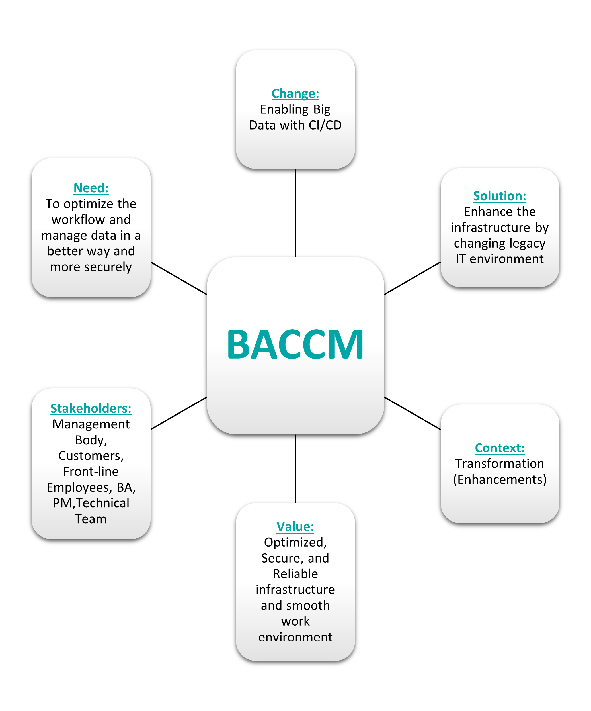

# Business Analysis of the change "Enabling Big Data with CI/CD"

## Company Introduction
The company is one of the largest insurance companies in the Canada and offers a wide range of primary and health insurance products to businesses (employees) and individuals (private). This publicly operated company currently has over 10,000 employees in total and has revenue of over $20 billion over its various business units and 18 branches throughout Canada.

## Business Challenge
This insurance company has Big Data computational requirements for actuarial designs which are executed against a fine range of databases habitually on daily basis. These databases run on nearly 150 Virtual Machines (VMs), and need to frequently be managed, monitored, and upgraded all while enabling Continuous Integration and Continuous Development (CI/CD) in testing and production environments.

We are looking for a tool that would enable support of our existing tool chain, and customized cloud environment - Chef and VMware with a custom-built distro (distribution - deployment of software - is nearly always used in a Linux context.), while providing strong custom workflows to support the variety of tooling.

## BPMN

## Technical Aspects
- HealthCare Insurance needs a Cloud-based Big Data service – Cloudify Orchestration Platform – to deploy databases on demand, manage them, and upgrade them as needed through a simple application blueprint while tying all of the pieces of the infrastructure and application together.

- We are looking for application-level orchestration solutions that can support our existing stack, communicate, and process data coming from our infrastructure orchestrator, as well as support a multiple existing applications.

- The complex architecture (solution architecture) contains a management portal to request environment provisioning, an existing IaaS orchestrator that sends JSON requests to Cloudify, a DNS/DHCP that receives the IPs, Cloud, Docker containers, Chef for application deployment, along with more than 3 backup and monitoring tools.

- We selected Cloudify based on the open and highly modular plugin architecture that supports any technology, as well as the support for custom, complex workflows, that enables us to innovate and leverage Cloudify for less orthodox scenarios with our latest technology based environments.

## Business Analysis Core Concept Model (BACCM)

## Key Problems
- Data Insertion is done manually and sometimes the wrong data is entered which led us to wrong conclusions and cost the company a lot
- Database is cleaned manually which takes tremendous amount of time as the size of data that needs to be cleaned regularly is quite large
- Not all data engineers can perform the complex queries to solve some difficult problems
- Manual workflow can be accessed by anyone if the premises are not secure which can lead to serious data security issues
- Operations that are performed manually are not as reliable as they’re done automatically
- Errors and Faults cannot be detected at an early stage by humans
- The company has to rely on Data Team if any issue arises
- The overall performance of the company is depended only on Data Team
- The operations and execution of work can be done at the company premises only, considering today’s situation it would have been easier to complete all the tasks from home if such systems and architecture is implemented replacing the old and manual systems

## Goal Chart

## Project Scope
#### In Scope
- A new work environment to handle Data operations
- Deployment of latest legacy systems
- An automated custom CI/CD workflow
- Cloud based services and tools
- Big Data to handle complex Data requirements
- Latest Backup and Monitoring tools which can support the new systems
- Eliminate Hardware Data Storage (on premises storage)
- Transfer all the data to Cloud services
- Hiring Data Engineers (if necessary)
- Training for Data Team and other related employees to use the new technologies and tools
- Account setup, Permission assignments, and other security tasks

#### Out of Scope
- Support for any other team apart from Technical and Operations Team
- Allowance of more than one Cloud services
- Usage of manual (old) procedures, systems, or tools
- New Hardware implementation
- Customer Support (Engagement)

## Gap Analysis

## Stakeholder Analysis

## Solution Evaluation

## Project Schedule and Timeline (Roadmap) 

